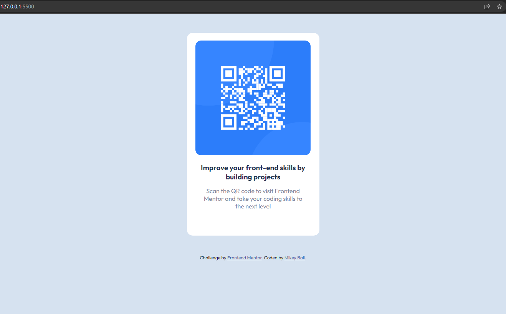

# Frontend Mentor - QR code component solution

## Table of contents

- [Overview](#overview)
  - [Screenshot](#screenshot)
- [My process](#my-process)
  - [Built with](#built-with)
  - [What I learned](#what-i-learned)
  - [Continued development](#continued-development)
  - [Useful resources](#useful-resources)
- [Author](#author)
- [Acknowledgments](#acknowledgments)

**Note: Delete this note and update the table of contents based on what sections you keep.**

## Overview

This is mt first attempt at the solution to the [QR code component challenge on Frontend Mentor](https://www.frontendmentor.io/challenges/qr-code-component-iux_sIO_H). Frontend Mentor challenges help you improve your coding skills by building realistic projects. 

### Screenshot



## My process

1. Created custom properties in CSS based on the style-guide.
2. Oriented and styled page accordingly.

### Built with

- Semantic HTML5 markup
- CSS custom properties
- Flexbox
- Mobile-first workflow
- [Styled Components](https://styled-components.com/) - For styles

### What I learned

This challenge was a great way to get my feet wet with frontend development. Helped me to visually reinforce what I have taught myself and translate the given design into code. 

First time utilizing custom properties to better my workflow...

```css
:root {
    /* colors */
    --white: hsl(0, 0%, 100%);
    --lt-gray: hsl(212, 45%, 89%);
    --gray-blue: hsl(220, 15%, 55%);
    --drk-blue: hsl(218, 44%, 22%);

    /* typography */
    /* size */
    --fs-400: 0.938rem; /* 15 px */
    /* font */
    --ff-sans: 'Outfit', sans-serif;
}
```

NOTE: Took into consideration comments from frontend mentor and applied those changes for better accessibility, more semantic HTML, and better CSS use for responsive design and fixed those issues.

### Continued development

Use this section to outline areas that you want to continue focusing on in future projects. These could be concepts you're still not completely comfortable with or techniques you found useful that you want to refine and perfect.

I will continue to use Frontend Mentor to reinforce and learn new ways of building frontend applications. I would like to become more streamlined and proficient in CSS.

## Author

- Frontend Mentor - [@MikeyABall](https://www.frontendmentor.io/profile/MikeyABall)
